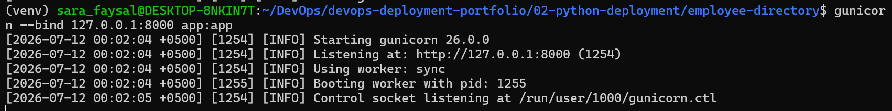
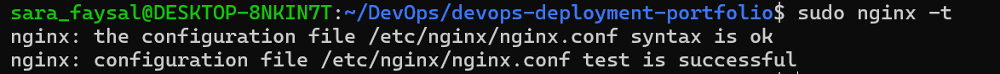
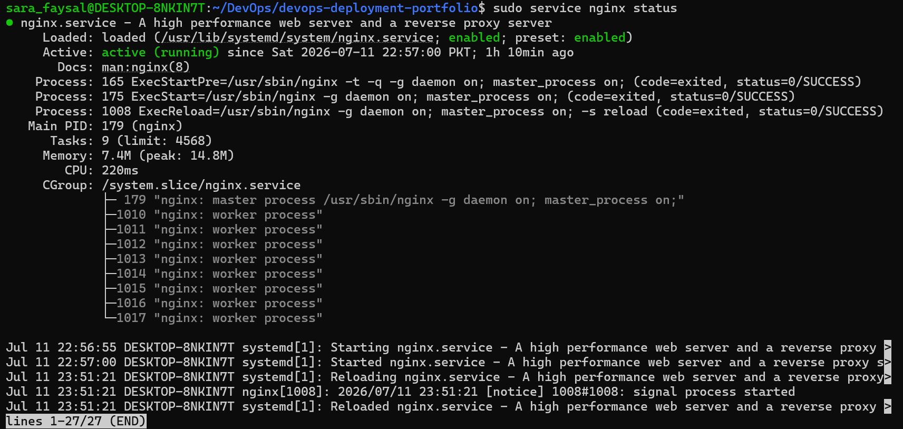
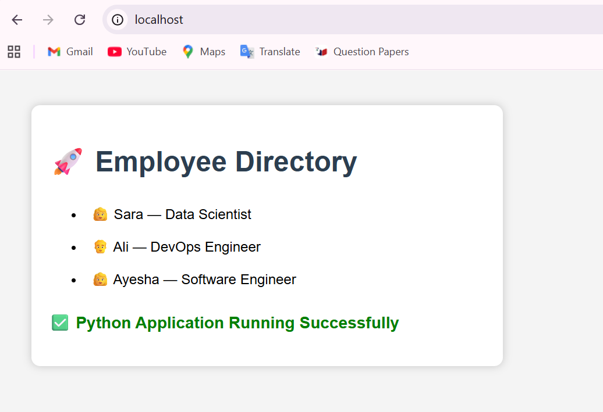

# Python Application Deployment

## Objective

Deploy a Python Flask application using Gunicorn and Nginx on Ubuntu (WSL2).

---

## Technologies Used

- Ubuntu 24.04 (WSL2)
- Python 3.12
- Flask
- Gunicorn
- Nginx
- Git & GitHub

---

## Project Structure

```
02-python-deployment/
│── employee-directory/
│── screenshots/
│── README.md
```

---

## Deployment Steps

1. Created a Python virtual environment.
2. Installed Flask and Gunicorn.
3. Started the Flask application using Gunicorn.
4. Installed Nginx.
5. Configured Nginx as a Reverse Proxy.
6. Verified the deployment in the browser.

---

## Architecture

```
Browser
   │
   ▼
Nginx
   │
   ▼
Gunicorn
   │
   ▼
Flask Application
```

---

## Screenshots

### Employee Directory


### Gunicorn Running



### Nginx Configuration Test



### Nginx Service Status



### Reverse Proxy Working



---

## Result

Successfully deployed a Python Flask application using Gunicorn behind Nginx as a Reverse Proxy.
