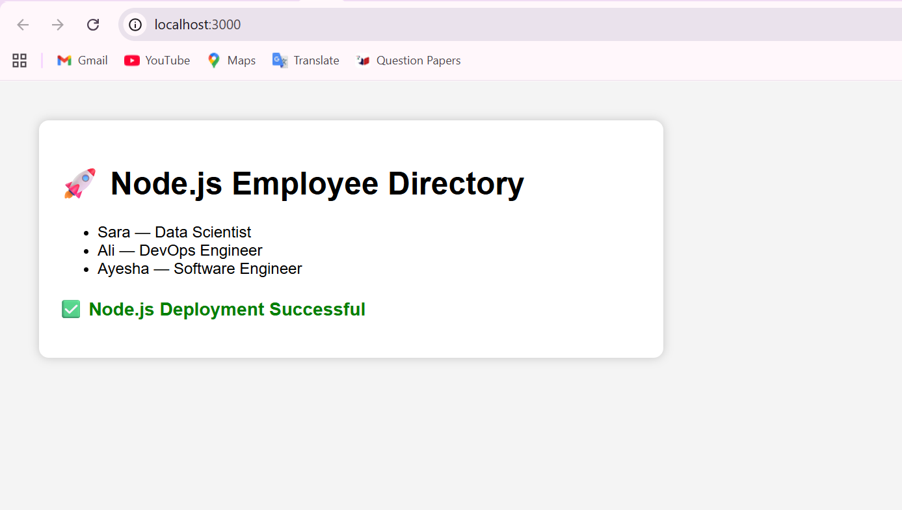
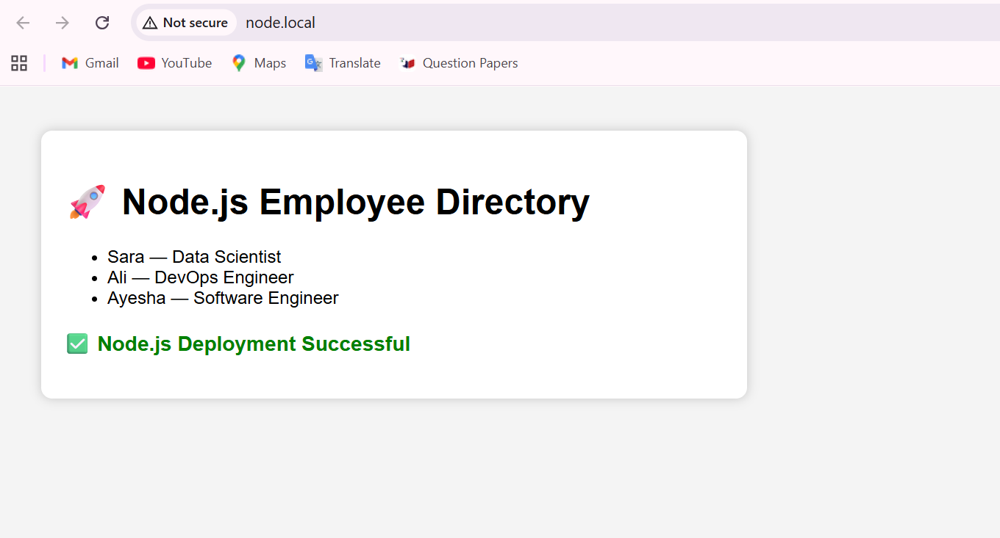
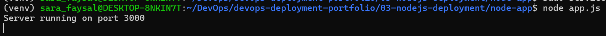
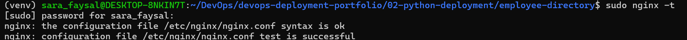

# Node.js Deployment using Nginx

## Objective

Deploy a Node.js Express application behind Nginx using a reverse proxy.

## Technologies Used

- Ubuntu 24.04 (WSL2)
- Node.js
- Express.js
- Nginx

## Application

The application is a simple Employee Directory built with Express.js.

## Deployment Steps

1. Installed Node.js and npm.
2. Created an Express application.
3. Ran the application on port **3000**.
4. Configured Nginx to forward requests to the Node.js application.
5. Created the local domain **node.local**.

## Testing

- http://localhost:3000
- http://node.local

## Result

Successfully deployed a Node.js application using Nginx as a reverse proxy.

## Screenshots

