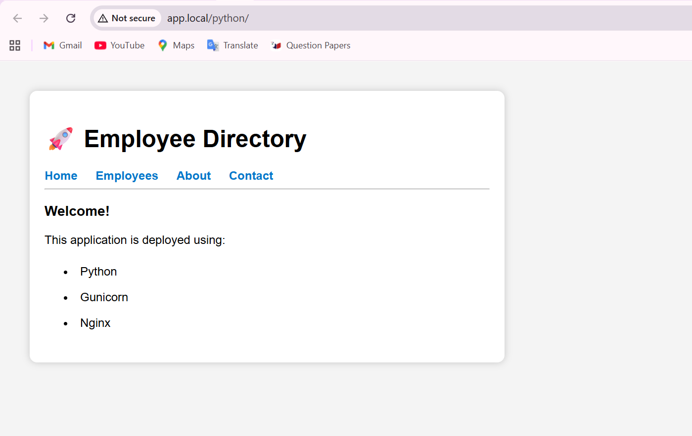
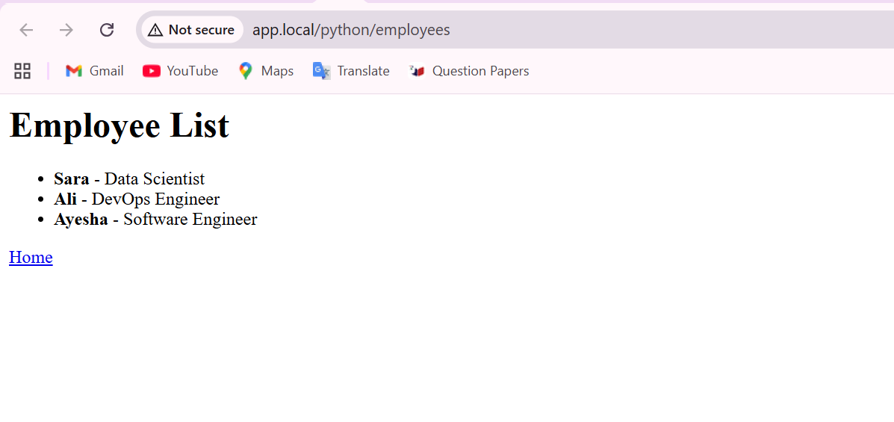
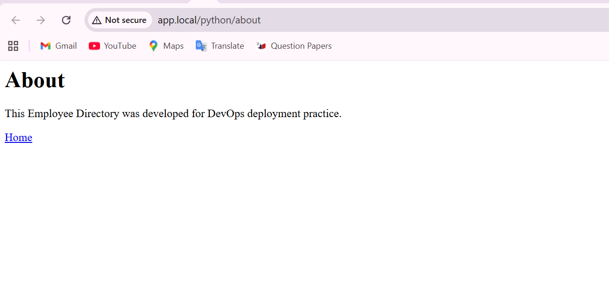
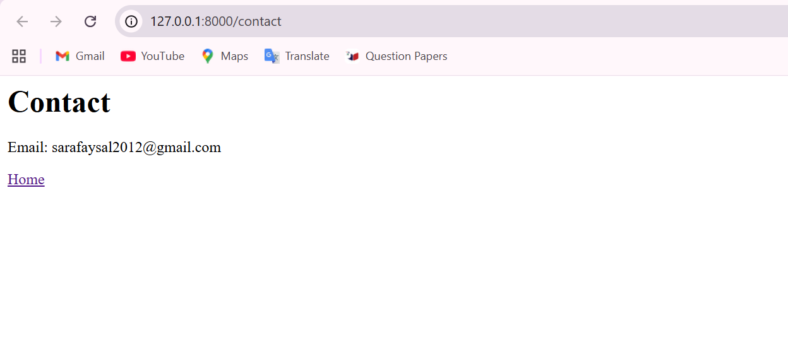

# Context-Based Routing using Nginx

## Objective

Configure Nginx to route requests based on URL context to a Python Flask application.

---

## Technologies Used

- Ubuntu 24.04 (WSL2)
- Python Flask
- Gunicorn
- Nginx

---

## Route Configuration

| URL | Destination |
|------|-------------|
| /python | Flask Application |
| /python/employees | Employee List |
| /python/about | About Page |
| /python/contact | Contact Page |

---

## Nginx Configuration

A dedicated server block was created for **app.local**.

Requests beginning with `/python` are forwarded to the Flask application running on Gunicorn.

---

## Testing

The following URLs were verified:

- http://app.local/python/
- http://app.local/python/employees
- http://app.local/python/about
- http://app.local/python/contact

---

## Screenshots

### Home

### Employees

### About

### Contact

---

## Result

Successfully implemented Context-Based Routing using Nginx and deployed a Python Flask application behind Gunicorn.
